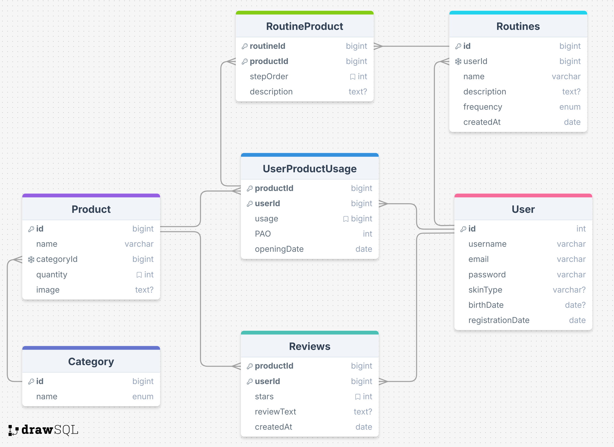
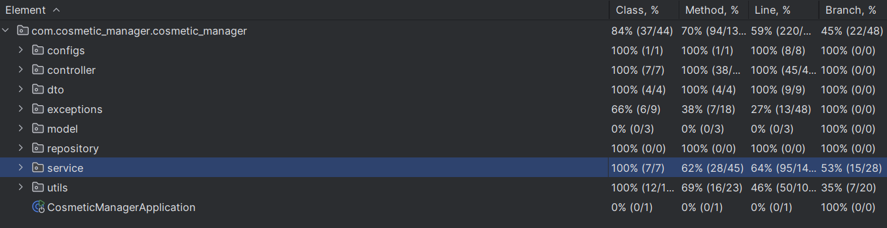
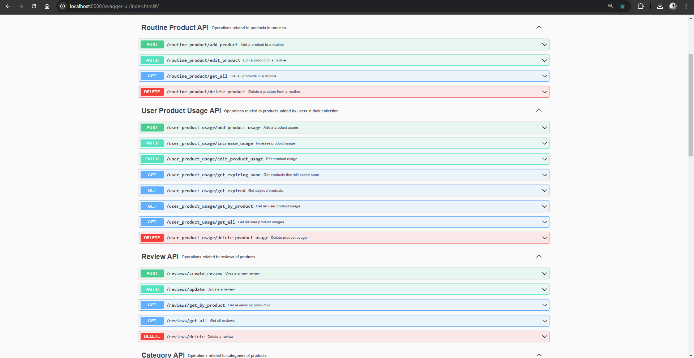
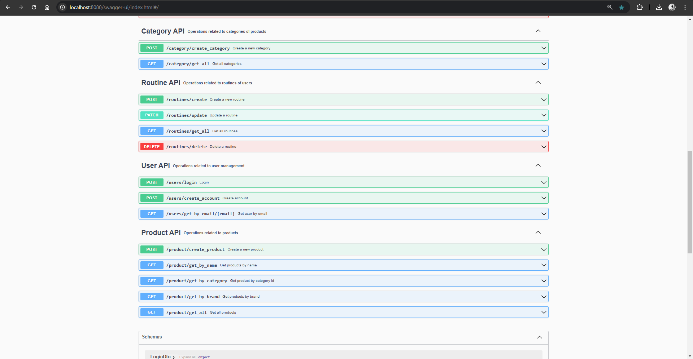
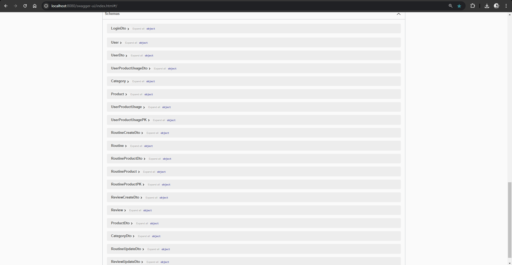

# CosmeticManager

## Summary
1. [Description](#description)
2. [Business Requirements](#business-requirements)
3. [Features of the MVP](#features-of-the-mvp)
4. [Models Diagram](#models-diagram)
5. [API Documentation](#api-documentation)

### Description
CosmeticManager is a Spring Boot 3.4 application for tracking beauty product usage, aiming to support sustainability in daily life. It also encourages users to explore new styles with their cosmetic products, creating an inspiring atmosphere for them.

### Business Requirements
For this application, I have identified the following 10 business requirements:
1. Users should be able to create an account and log in.
2. Users should be able to add products to their collection and also edit or delete them.
3. Products are grouped by categories, so users can view products by category.
4. Once a product is added to the collection, users should be able to track their usage of it (to motivate them to use their products).
5. Once a product is added to the collection, users should be able to track the expiration date of it.
6. Users should be able to add review for products.
7. Users should be able to create custom routines specific to their needs, with a specific frequency (e.g. daily, weekly, monthly, seasonal, special occasions, etc.).
8. Users should be able to add products to their routines and specify the corresponding step in the routine (e.g. 1st step, 2nd step, etc.).
9. Users can monitor which products are going to expire soon.
10. Users can see statistics of their products, e.g. how many products they have, how many products they have used, how many products they have reviewed, etc.

### Features of the MVP
The following features are included in the MVP:
1. Login and registration

    The user can create an account and log in. This features ensures that the user can have a personalized experience.

2. Add, Edit, Delete Products

    The user can add products to their collection, edit the product information and delete the product from their collection. This feature allows users to manage their collection of products.

3. Keep Track of Product Usage

    The user can track their usage of the products in their collection. This feature allows users to monitor their product usage and motivates them to use their products. It will create a game-like experience for the user, as they can see their progress and feel like they can "win".

4. Create and Manage Routines

    The user can create custom routines and add products to their routines. This feature allows users to better organize their product usage. 

5. Add and View Reviews

    The user can add review for products and view the review added by other users. This feature allows users to share their experience with the products and learn from others before making a purchase.

### Models Diagram
The following diagram shows the 7 models that are used in the application and their relationships. The models are:
- `User` (The user of the application)
- `Product` (The cosmetic product available in the application)
- `Category` (The category of the product, e.g. makeup, skincare, nail care, hair care)
- `UserProductUsage` (The usage of a product added in his collection by a user)
- `Reviews` (The review added by users for different products)
- `Routines` (Custom routines created by users)
- `RoutineProduct` (Product used in a custom routine by a user)

### API Documentation
The API documentation is available at `http://localhost:8080/swagger-ui/index.html#/` when the application is running.

### Testing
The application has been tested using JUnit 5 and Mockito. 

#### Swagger documentation

